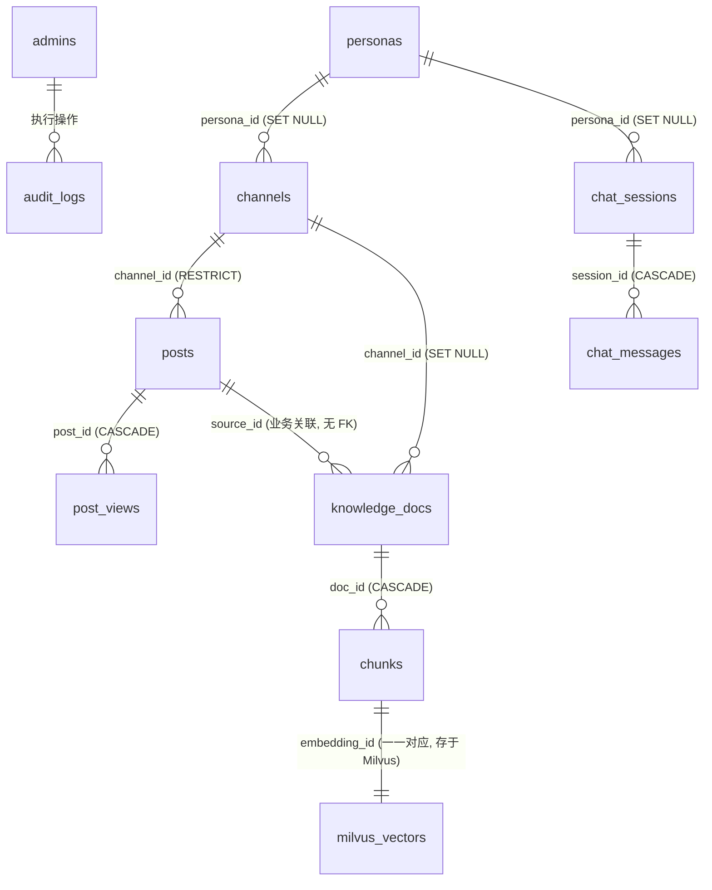

# 数据表设计

> 版本：v1.0 ｜ 日期：2026-07-24
> 配套：[后端设计方案.md](./后端设计方案.md) §4.1
> 范围：定义 InkGrid 后端 PostgreSQL 全部数据表的结构、业务用途、表间关系、索引与状态机。
> 实现：ORM 模型位于 `backend/app/models/`，迁移脚本位于 `backend/alembic/versions/`，初始化脚本 `backend/scripts/init_db.py`。

---

## 一、总览

InkGrid 共 11 张表，按业务域划分为 5 组：

| 业务域 | 表 | 用途 |
|--------|-----|------|
| 鉴权 | `admins` | 博主账号 |
| 审计 | `audit_logs` | 后台写操作留痕 |
| 内容 | `personas` / `channels` / `posts` / `post_views` | 人设、频道、文章、访问日志 |
| 问答 | `chat_sessions` / `chat_messages` | 会话与消息 |
| 知识库 | `knowledge_docs` / `chunks` | 文档与分块（PG chunks 与 Milvus 向量一一对应） |
| 配置 | `site_settings` | 站点单行配置 |

---

## 二、ER 关系图



> 说明：`posts` 与 `knowledge_docs` 之间无外键约束，仅通过 `knowledge_docs.source_type='article'` + `knowledge_docs.source_id = posts.id` 建立业务关联。这样设计是为了支持 `source_type` 多态（article/upload/policy），同时让知识库失败不影响文章本身的 CRUD。

---

## 三、表详细设计

### 3.1 admins — 博主账号

**业务用途**：后台唯一登录身份，密码用 argon2 哈希存储。所有 `/api/admin/*` 路由的鉴权都基于此表。

| 字段 | 类型 | 约束 | 说明 |
|------|------|------|------|
| id | UUID | PK, default uuid4 | 主键 |
| username | VARCHAR(50) | NOT NULL, UNIQUE | 登录用户名 |
| password_hash | VARCHAR(200) | NOT NULL | argon2 哈希 |
| created_at | TIMESTAMPTZ | NOT NULL, default now() | 创建时间 |
| updated_at | TIMESTAMPTZ | NOT NULL, default now(), onupdate now() | 更新时间 |

**关系**：无外键，是 `audit_logs.actor` 的语义来源。

**初始化**：通过 `scripts/create_admin.py <username> <password>` 创建，不进 `init_db.py` 种子数据。

---

### 3.2 audit_logs — 审计日志

**业务用途**：所有后台写操作（create/update/delete/login）记入此表，保留 90 天。用于合规追溯与异常检测。

| 字段 | 类型 | 约束 | 说明 |
|------|------|------|------|
| id | BIGSERIAL | PK | 自增主键 |
| actor | VARCHAR(100) | NULL | 操作者（admin_id 或 anon_id） |
| action | VARCHAR(50) | NOT NULL | 操作类型，如 `create_post` / `login` |
| target | VARCHAR(100) | NULL | 操作对象标识，如 post_id |
| meta | JSONB | NULL | 附加上下文（变更前后值、IP 等） |

**关系**：`actor` 字段语义上关联 `admins.id` 或匿名 ID，但未建外键（避免删除 admin 时连带删日志）。

**索引**：无（按需在查询时过滤）。

---

### 3.3 personas — 人设

**业务用途**：定义问答 AI 的角色身份（名称、标语、系统提示词）。公开响应不含 `system_prompt`。

| 字段 | 类型 | 约束 | 说明 |
|------|------|------|------|
| id | UUID | PK, default uuid4 | 主键 |
| serial | VARCHAR(8) | NOT NULL, UNIQUE | 短编号 "001"，用于前端排序 |
| name | VARCHAR(50) | NOT NULL | 人设名称，如 "政策顾问" |
| tagline | VARCHAR(100) | NOT NULL | 一句话标语 |
| description | TEXT | NOT NULL | 详细描述 |
| tags | TEXT[] | NULL | 标签数组，用于筛选 |
| avatar | TEXT | NULL | 头像 URL（MinIO） |
| system_prompt | TEXT | NOT NULL | 完整系统提示词（不公开） |
| scope | VARCHAR(20) | NOT NULL, default 'global' | global \| channel |
| created_at | TIMESTAMPTZ | NOT NULL, default now() | |
| updated_at | TIMESTAMPTZ | NOT NULL, default now(), onupdate now() | |

**关系**：
- 被 `channels.persona_id` 引用（ondelete=SET NULL，删人设时频道的人设置空）
- 被 `chat_sessions.persona_id` 引用（ondelete=SET NULL）

**初始化**：`init_db.py` 种子数据写入 serial="001" 的默认人设 "InkGrid 助手"。

---

### 3.4 channels — 频道

**业务用途**：按知识域组织文章（如 "博客" / "政策"）。频道是 RAG 三级范围路由的中间层（全站 / 频道 / 文章），每个频道可绑定一个人设。

| 字段 | 类型 | 约束 | 说明 |
|------|------|------|------|
| id | UUID | PK, default uuid4 | 主键 |
| slug | VARCHAR(50) | NOT NULL, UNIQUE | URL 友好标识，如 "policy" |
| name | VARCHAR(50) | NOT NULL | 显示名称 |
| description | TEXT | NULL | 频道描述 |
| accent | VARCHAR(20) | NULL | channel \| policy，前端主题策略 |
| persona_id | UUID | FK → personas.id, SET NULL, NULL | 绑定的人设 |
| created_at | TIMESTAMPTZ | NOT NULL, default now() | |
| updated_at | TIMESTAMPTZ | NOT NULL, default now(), onupdate now() | |

**关系**：
- `persona_id` → `personas.id`（删人设时置空）
- 被 `posts.channel_id` 引用（ondelete=RESTRICT，需先迁移文章才能删频道）
- 被 `knowledge_docs.channel_id` 引用（ondelete=SET NULL）
- ORM 反向关系 `posts` / `persona` 均 lazy=selectin，避免 N+1

**初始化**：不种数据，由博主在后台自行创建。

---

### 3.5 posts — 文章

**业务用途**：博客文章，也是知识库的源文档。发布（status=published）即触发 Celery 入库任务。前端直接渲染 `content_md`，`content_html` 字段暂不填充。

| 字段 | 类型 | 约束 | 说明 |
|------|------|------|------|
| id | UUID | PK, default uuid4 | 主键 |
| slug | VARCHAR(120) | NOT NULL, UNIQUE | URL 标识，从 title 自动生成 |
| title | VARCHAR(200) | NOT NULL | 标题 |
| excerpt | VARCHAR(500) | NULL | 一行摘要，从首段自动提取 |
| content_md | TEXT | NOT NULL | Markdown 源码 |
| content_html | TEXT | NULL | 预渲染 HTML（缓存，未填充） |
| channel_id | UUID | FK → channels.id, RESTRICT, NOT NULL | 所属频道 |
| tags | TEXT[] | NULL | 标签数组 |
| status | VARCHAR(20) | NOT NULL, default 'draft' | draft \| published \| archived |
| published_at | TIMESTAMPTZ | NULL | 首次发布时间 |
| reading_time | INTEGER | NULL | 阅读时长（分钟），按字数估算 |
| toc | JSONB | default '[]' | `[{id,title,level}]` 目录，从标题生成 |
| created_at | TIMESTAMPTZ | NOT NULL, default now() | |
| updated_at | TIMESTAMPTZ | NOT NULL, default now(), onupdate now() | |

**索引**：
- `ix_posts_status_published_at` (status, published_at) — 公开列表按发布时间倒序
- `ix_posts_channel_published_at` (channel_id, published_at) — 频道文章列表

**关系**：
- `channel_id` → `channels.id`（RESTRICT，防误删）
- ORM `channel` 关系 lazy=selectin
- 与 `knowledge_docs` 业务关联（`source_type='article'` + `source_id=posts.id`），无 FK
- 与 `post_views` 一对多（CASCADE）

---

### 3.6 post_views — 文章访问日志

**业务用途**：每次 `GET /api/posts/:slug` 插入一条，用于看板 `monthlyViews` 精确统计。设计文档 §5.3.1 提到 P0 阶段曾用 `chat_sessions + posts` 估算，P3 接入此表后替换。

| 字段 | 类型 | 约束 | 说明 |
|------|------|------|------|
| id | BIGSERIAL | PK | 自增主键 |
| post_id | UUID | FK → posts.id, CASCADE, NOT NULL | 文章 ID |
| created_at | TIMESTAMPTZ | NOT NULL, default now() | 访问时间 |

**索引**：
- `ix_post_views_post_created` (post_id, created_at) — 按文章查访问趋势
- `ix_post_views_created` (created_at) — 按时间范围聚合（看板月访问量）

**关系**：`post_id` → `posts.id`（CASCADE，删文章连带删访问记录）。

**迁移**：alembic `0002_post_views.py`。

---

### 3.7 chat_sessions — 问答会话

**业务用途**：一次问答会话（匿名或注册用户）。`anon_id` 来自前端 localStorage，用于会话列表与限流。

| 字段 | 类型 | 约束 | 说明 |
|------|------|------|------|
| id | UUID | PK, default uuid4 | 主键 |
| anon_id | VARCHAR(64) | NULL, INDEX | 匿名访客 ID |
| user_id | UUID | NULL | 注册访客（预留，未启用） |
| persona_id | UUID | FK → personas.id, SET NULL, NULL | 使用的角色 |
| scope_type | VARCHAR(20) | NOT NULL, default 'global' | global \| channel \| article |
| scope_ref | VARCHAR(100) | NULL | channel slug 或 article slug |
| title | VARCHAR(200) | NULL | 会话标题（由首问生成） |
| created_at | TIMESTAMPTZ | NOT NULL, default now() | |
| updated_at | TIMESTAMPTZ | NOT NULL, default now(), onupdate now() | |

**索引**：`ix_chat_sessions_anon_id` (anon_id) — 按 anon_id 列会话。

**关系**：
- `persona_id` → `personas.id`（SET NULL）
- 与 `chat_messages` 一对多（CASCADE，删会话连带删消息）
- ORM `messages` 关系 lazy=selectin + cascade=all,delete-orphan

---

### 3.8 chat_messages — 问答消息

**业务用途**：会话内的单条消息（用户问题 / AI 回答 / 澄清选项）。`citations` 是引用溯源的 JSONB 数组，看板据此统计热门文章。

| 字段 | 类型 | 约束 | 说明 |
|------|------|------|------|
| id | UUID | PK, default uuid4 | 主键 |
| session_id | UUID | FK → chat_sessions.id, CASCADE, NOT NULL | 所属会话 |
| role | VARCHAR(20) | NOT NULL | user \| assistant \| clarify |
| content | TEXT | NOT NULL | 消息内容 |
| citations | JSONB | NULL | `[{articleId,title,slug,snippet}]` |
| follow_ups | TEXT[] | NULL | 推荐追问列表 |
| tokens_in | INTEGER | NULL | 输入 token 数（计费） |
| tokens_out | INTEGER | NULL | 输出 token 数 |
| latency_ms | INTEGER | NULL | 端到端延迟 |
| created_at | TIMESTAMPTZ | NOT NULL, default now() | |

**索引**：`ix_chat_messages_session_created` (session_id, created_at) — 按会话查历史。

**关系**：`session_id` → `chat_sessions.id`（CASCADE）。

---

### 3.9 knowledge_docs — 知识库文档

**业务用途**：一篇文章 / 一份上传文档 / 一条政策条目对应一条记录。是 RAG 入库管道的核心状态机载体。

| 字段 | 类型 | 约束 | 说明 |
|------|------|------|------|
| id | UUID | PK, default uuid4 | 主键 |
| source_type | VARCHAR(20) | NOT NULL | article \| upload \| policy |
| source_id | UUID | NULL | 关联源对象 ID（article 时为 posts.id） |
| title | VARCHAR(200) | NOT NULL | 文档标题 |
| raw_uri | TEXT | NULL | MinIO 对象键（所有上传文件均归档；article 类型为 NULL） |
| original_filename | VARCHAR(255) | NULL | 用户上传时的原始文件名（用于前端展示与下载文件名） |
| source_format | VARCHAR(20) | NULL | 源文件格式标识：md \| txt \| pdf \| docx（article 类型为 NULL） |
| mime_type | VARCHAR(100) | NULL | 上传时浏览器上报的 MIME（如 application/pdf），用于下载时还原 Content-Type |
| source_size | BIGINT | NULL | 源文件字节数（用于看板容量统计与配额校验） |
| parsed_text | TEXT | NULL | 提取后的纯文本 |
| chunk_count | INTEGER | NOT NULL, default 0 | 分块数量 |
| channel_id | UUID | FK → channels.id, SET NULL, NULL | 用于范围路由 |
| status | VARCHAR(20) | NOT NULL, default 'pending' | 见状态机 |
| error_msg | TEXT | NULL | 失败原因（前 400~500 字） |
| created_at | TIMESTAMPTZ | NOT NULL, default now() | |
| updated_at | TIMESTAMPTZ | NOT NULL, default now(), onupdate now() | |

**索引**：`ix_knowledge_docs_channel_status` (channel_id, status) — 看板按频道 + 状态聚合。

**字段设计说明**：
- `raw_uri`：所有上传文件（md/txt/pdf/docx）统一归档到 MinIO，`raw_uri` 存对象键（如 `docs/202607/{uuid}.pdf`）。article 类型由 `ingest_article` 创建，不归档原文件，raw_uri 为 NULL。
- `original_filename` 与 `raw_uri` 分离：MinIO 对象键用 UUID 命名避免冲突与路径遍历，原始文件名单独存储供前端展示和下载时还原文件名。
- `source_format`：解析器分派依据，pipeline 根据 `source_format` 选择 `parse_markdown` / `parse_pdf` / `parse_docx` / `parse_text`。
- `mime_type`：浏览器上传时上报，下载时回写为 Content-Type 响应头，避免扩展名猜 MIME。
- `source_size`：原始文件字节数，用于看板显示与未来配额限制（如单频道 500MB）。

**关系**：
- `channel_id` → `channels.id`（SET NULL）
- 与 `chunks` 一对多（CASCADE，删 doc 连带删 chunks）
- ORM `chunks` 关系 lazy=selectin + cascade=all,delete-orphan
- 与 `posts` 业务关联（`source_type='article'` + `source_id=posts.id`），无 FK

**状态机**：

```
                ┌─────────┐
       新建 ──► │ pending │
                └────┬────┘
                     │ 解析+分块+写 PG+embedding+写 Milvus 全成功
                     ▼
                ┌─────────┐
                │ indexed │ ── 文章更新时删旧建新，回到 pending
                └─────────┘

                ┌─────────┐
   Milvus 失败 ► │ partial │ ── PG 有 chunks,缺向量,可手动 reindex
                └─────────┘

                ┌─────────┐
 解析/分块失败 ► │ failed  │ ── 看 error_msg 排查,修复后重新触发
                └─────────┘
```

- `pending`：新建，分块进行中
- `indexed`：解析 → 分块 → 写 PG → embedding → 写 Milvus 全部成功
- `partial`：PG chunks 成功但 Milvus 失败（不阻断入库，PG 有 chunks 缺向量，可手动 reindex）
- `failed`：解析 / 分块失败，看 `error_msg` 排查

**触发时机**：
- 文章 draft → published：异步入库
- 文章已发布 + 内容变更：删旧 chunks + 重新入库（幂等）
- 文章 published → archived/draft：删除对应 chunks
- 文章删除：删除 knowledge_docs + chunks + Milvus 向量

---

### 3.10 chunks — 分块

**业务用途**：文章按标题层级 + 滑窗切分后的文本片段。每条 chunk 与 Milvus 中一条向量一一对应（通过 `embedding_id` 关联）。RAG 检索时先查 Milvus 拿到 `embedding_id`，再回 PG 查 `content` 用于 rerank 与上下文组装。

| 字段 | 类型 | 约束 | 说明 |
|------|------|------|------|
| id | UUID | PK, default uuid4 | 主键 |
| doc_id | UUID | FK → knowledge_docs.id, CASCADE, NOT NULL | 所属文档 |
| seq | INTEGER | NOT NULL | 块序号（同 doc 内从 0 递增） |
| content | TEXT | NOT NULL | 原文片段 |
| token_count | INTEGER | NULL | token 估算（中文 1:1，英文 4:1） |
| embedding_id | VARCHAR(64) | NULL | Milvus 主键，格式 `{doc_id}_{seq}`，未写入时为 NULL |
| metadata | JSONB | NULL | `{article_slug, heading, tags}` |

> **特殊说明**：`metadata` 是 PostgreSQL 与 SQLAlchemy 双重保留字，ORM 层用 Python 属性名 `metadata_`（带下划线）映射到列名 `metadata`。代码中访问 `chunk.metadata_`，DB 列名为 `metadata`。

**索引**：`ix_chunks_doc_seq` (doc_id, seq) — 按文档查全部分块并排序。

**关系**：
- `doc_id` → `knowledge_docs.id`（CASCADE）
- 与 Milvus `inkgrid_chunks` collection 一一对应（`embedding_id` = Milvus 主键）

**Milvus Collection Schema**（配套，非 PG 表）：

| 字段 | 类型 | 说明 |
|------|------|------|
| id | VARCHAR(64) PK | 与 `chunks.embedding_id` 对齐 |
| doc_id | VARCHAR(64) | |
| channel | VARCHAR(32) | 用于 partition 路由 |
| article_slug | VARCHAR(64) | |
| heading | VARCHAR(200) | |
| tags | JSON | |
| content | VARCHAR(8192) | 原文（rerank 输入） |
| vector_dense | FLOAT_VECTOR(1024) | BGE-M3 稠密 |
| vector_sparse | SPARSE_FLOAT_VECTOR | BGE-M3 稀疏（BM25 视角） |

索引：稠密 HNSW (M=16, efConstruction=200, COSINE)，稀疏 SPARSE_INVERTED_INDEX (IP)。
分区：`global` / `channel_{slug}`，对应三级范围路由。

---

### 3.11 site_settings — 站点设置

**业务用途**：单行表（id 固定为 1），存储站点名称、作者、版本、扩展配置。`extra` JSONB 用于采集源清单、自定义菜单等。

| 字段 | 类型 | 约束 | 说明 |
|------|------|------|------|
| id | INTEGER | PK, default 1 | 固定为 1 |
| site_name | VARCHAR(100) | NOT NULL | 站点名称 |
| author | VARCHAR(50) | NOT NULL | 作者 |
| version | VARCHAR(20) | NOT NULL | 版本号 |
| extra | JSONB | NULL | 扩展配置 |

**关系**：无。

**初始化**：`init_db.py` 种子数据写入 id=1 的默认行。

---

## 四、索引清单

| 表 | 索引名 | 字段 | 用途 |
|----|--------|------|------|
| chat_sessions | ix_chat_sessions_anon_id | anon_id | 按 anon_id 列会话 |
| posts | ix_posts_status_published_at | (status, published_at) | 公开列表倒序 |
| posts | ix_posts_channel_published_at | (channel_id, published_at) | 频道文章列表 |
| chat_messages | ix_chat_messages_session_created | (session_id, created_at) | 会话消息历史 |
| knowledge_docs | ix_knowledge_docs_channel_status | (channel_id, status) | 看板按频道聚合 |
| chunks | ix_chunks_doc_seq | (doc_id, seq) | 按文档查分块 |
| post_views | ix_post_views_post_created | (post_id, created_at) | 文章访问趋势 |
| post_views | ix_post_views_created | (created_at) | 月访问量聚合 |

---

## 五、外键约束与级联策略

| 子表 → 父表 | 外键 | ondelete | 设计原因 |
|-------------|------|----------|---------|
| channels → personas | persona_id | SET NULL | 删人设时频道保留，人设置空 |
| posts → channels | channel_id | RESTRICT | 防误删频道导致文章孤立，需先迁移文章 |
| post_views → posts | post_id | CASCADE | 删文章连带删访问记录 |
| chat_sessions → personas | persona_id | SET NULL | 删人设时会话保留 |
| chat_messages → chat_sessions | session_id | CASCADE | 删会话连带删消息 |
| knowledge_docs → channels | channel_id | SET NULL | 删频道时知识库文档保留 |
| chunks → knowledge_docs | doc_id | CASCADE | 删文档连带删分块 |

**刻意无外键的业务关联**：
- `knowledge_docs.source_id` → `posts.id`：多态源（article/upload/policy），且知识库失败不应影响文章 CRUD
- `audit_logs.actor` → `admins.id`：日志需长期保留，删 admin 不应连带删日志

---

## 六、ORM 模型映射

ORM 模型位于 `backend/app/models/`，与上述表一一对应：

| 表 | ORM 模型 | 文件 |
|----|----------|------|
| admins | `Admin` | `app/models/admin.py` |
| audit_logs | `AuditLog` | `app/models/audit.py` |
| personas | `Persona` | `app/models/persona.py` |
| channels | `Channel` | `app/models/channel.py` |
| posts | `Post` | `app/models/post.py` |
| post_views | `PostView` | `app/models/post_view.py` |
| chat_sessions | `ChatSession` | `app/models/chat.py` |
| chat_messages | `ChatMessage` | `app/models/chat.py` |
| knowledge_docs | `KnowledgeDoc` | `app/models/knowledge.py` |
| chunks | `Chunk` | `app/models/knowledge.py` |
| site_settings | `SiteSettings` | `app/models/settings.py` |

公共基类与混入位于 `app/models/base.py`：
- `Base`：DeclarativeBase，所有模型继承
- `TimestampMixin`：提供 `created_at` / `updated_at` 字段（updated_at 用 `onupdate=func.now()` 在 ORM 层自动刷新）

`app/models/__init__.py` 聚合导出所有模型，确保 `from app.models import Base` 触发全部表注册到 `Base.metadata`（alembic env.py 与 init_db.py 依赖此行为）。

---

## 七、初始化与迁移

### 7.1 开发期（推荐）

```bash
cd backend
python scripts/init_db.py
```

`init_db.py` 调用 `Base.metadata.create_all`（checkfirst=True，幂等），并写入种子数据：
- `personas`：serial="001" 默认人设 "InkGrid 助手"
- `site_settings`：id=1 默认站点配置

> 博主账号不进种子数据，用 `python scripts/create_admin.py <username> <password>` 单独创建。

### 7.2 生产期（推荐 alembic）

```bash
cd backend
alembic upgrade head
```

迁移版本：
- `0001_init`：创建 admins / audit_logs / personas / channels / posts / chat_sessions / chat_messages / knowledge_docs / chunks / site_settings
- `0002_post_views`：创建 post_views

> `init_db.py` 与 `alembic upgrade head` 产生的表结构完全一致。开发期用前者更便捷，生产期用后者便于版本管理与增量迁移。

### 7.3 ORM 与迁移一致性约束

新增字段时必须同步更新：
1. `backend/app/models/<model>.py` — ORM 定义
2. `backend/alembic/versions/<xxxx>.py` — 迁移脚本
3. 本文档 §3 对应表的小节

`Base.metadata.create_all` 与 `alembic upgrade head` 的输出应保持一致，避免开发与生产环境表结构漂移。
